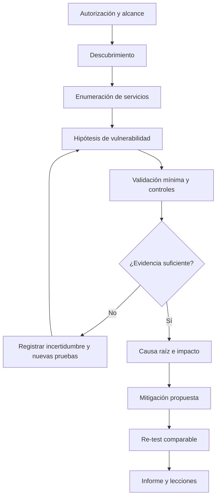
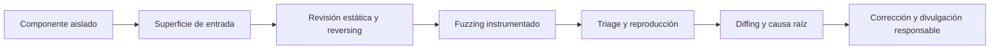

# Mapa de la metodología

```mermaid
flowchart TD
    A[Autorización y alcance] --> B[Descubrimiento]
    B --> C[Enumeración de servicios]
    C --> D[Hipótesis de vulnerabilidad]
    D --> E[Validación mínima y controles]
    E --> F{¿Evidencia suficiente?}
    F -- No --> G[Registrar incertidumbre y nuevas pruebas]
    G --> D
    F -- Sí --> H[Causa raíz e impacto]
    H --> I[Mitigación propuesta]
    I --> J[Re-test comparable]
    J --> K[Informe y lecciones]
```

## Ruta paralela de investigación de software

```mermaid
flowchart LR
    A[Componente aislado] --> B[Superficie de entrada]
    B --> C[Revisión estática y reversing]
    C --> D[Fuzzing instrumentado]
    D --> E[Triage y reproducción]
    E --> F[Diffing y causa raíz]
    F --> G[Corrección y divulgación responsable]
```

Estos diagramas son una **propuesta metodológica**, no una afirmación de ejecución de todas sus fases.
